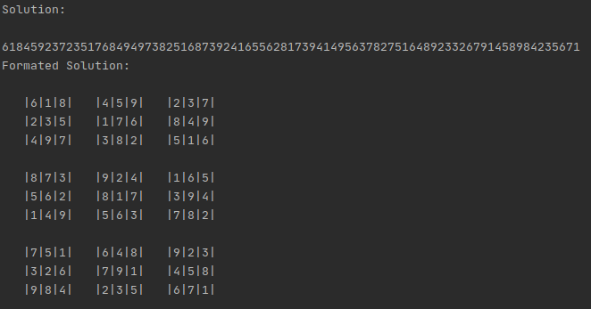

# Sudoku

Super USEFUL code written in golang to solve trivial sudokus and sudokus that require exploration too.

## Why?

I was bored in my COVID-19 quarantine and I was killing time by solving difficult sudokus. Later I did it learning golang. Then deducing the sudoku rules and writing them in go.

## Installation

```shell
go get github.com/xiscocapllonch/sudoku
```

## Usage

```golang
package main

import (
    "fmt"
    "github.com/xiscocapllonch/sudoku"
)

func main() {

    solution := sudoku.SolveSudoku(
        "000000000035070840097302510003904100060000090009503700051608920026090450000000000",
    )

    fmt.Printf("Solution: \n%v\n", solution)

    formatedSolution := sudoku.FormatPrintSudoku(solution)

    fmt.Printf("Formated Solution: \n%v\n", formatedSolution)
}
```

